# JARKOM-MODUL-2-2026-K-03

## Member

| Nama                      | NRP        | Pembagian Kerja |
| ------------------------- | ---------- | ---------- |
| Yovi Prayudya Rizky Ramadhani      | 5027251107 | No 1 - 3 & 11 - 20 |
| Dafa Ridho Zhafif  | 5027251129 | No 4 - 10 |

## Laporan

1. 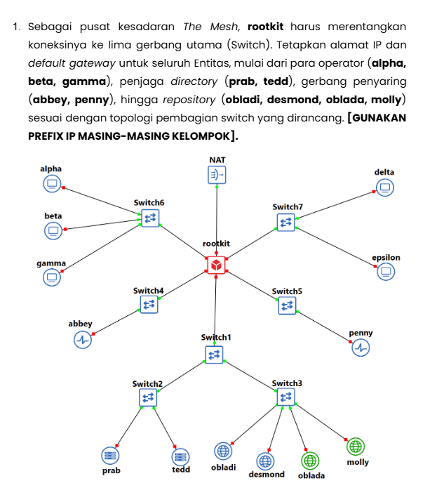

Untuk modelnya seperti berikut:

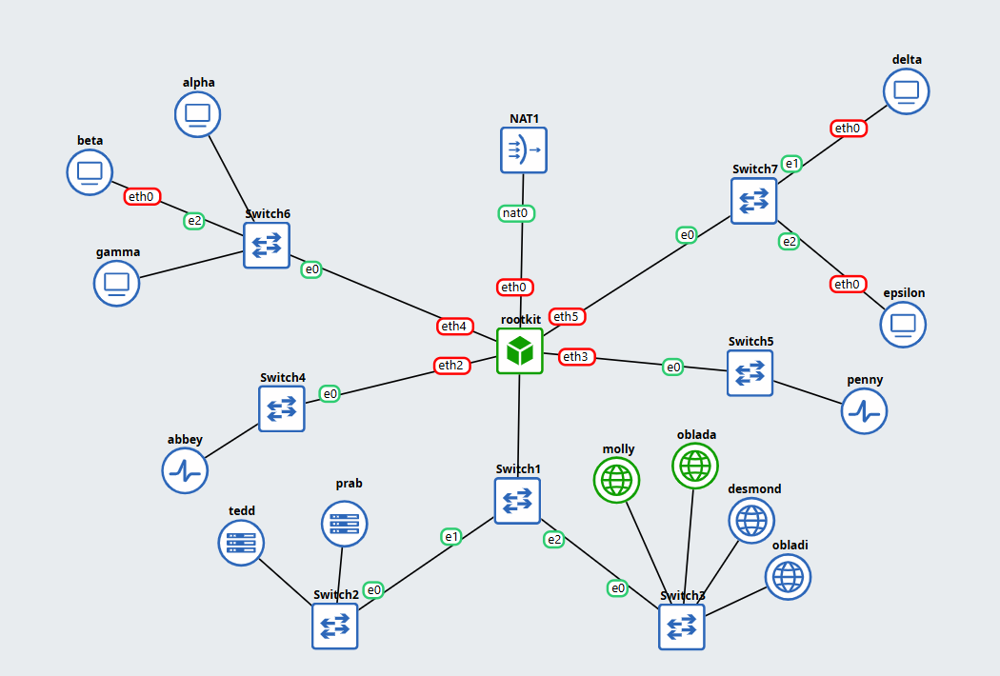

dengan:
- Rootkit sebagai router
- Alpha, Beta, Gamma, Delta, Epsilon sebagai operator
- Abbey dan Penny sebagai gerbang penyaring
- Prab dan Tedd sebagai penjaga directory
- obladi, desmond, oblada, molly sebagai repositori

2. 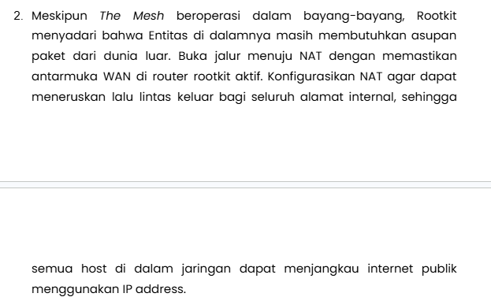

Untuk configure pada router Rootkit adalah sebagai berikut

```
auto eth0
iface eth0 inet dhcp
    up sysctl -w net.ipv4.ip_forward=1
    up iptables -t nat -A POSTROUTING -o eth0 -j MASQUERADE    

auto eth1
iface eth1 inet static
    address 10.65.2.1
    netmask 255.255.255.0
    echo "nameserver 8.8.8.8" > /etc/resolv.conf  

auto eth2
iface eth2 inet static
    address 10.65.4.1
    netmask 255.255.255.0
    echo "nameserver 8.8.8.8" > /etc/resolv.conf  

auto eth3
iface eth3 inet static
   address 10.65.5.1
   netmask 255.255.255.0
   echo "nameserver 8.8.8.8" > /etc/resolv.conf  

auto eth4
iface eth4 inet static
   address 10.65.6.1
   netmask 255.255.255.0
   echo "nameserver 8.8.8.8" > /etc/resolv.conf  

auto eth5
iface eth5 inet static
   address 10.65.7.1
   netmask 255.255.255.0
   echo "nameserver 8.8.8.8" > /etc/resolv.conf
```

sesuai dengan [modul 1 Jarkom lab KCKS repository](https://github.com/lab-kcks/modul-komdat-jarkom-2026/tree/main/Modul%201) sebagai referensinya. Penjelasannya pada [github saya modul 1](https://github.com/Lunatic-Yui/Jarkom-Modul-1-2026-K-03)

3. 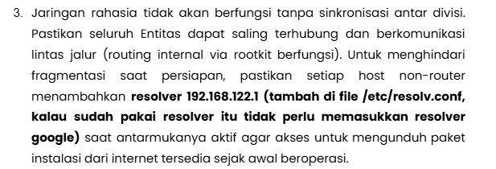

Untuk configurenya saya pakai modul 1 juga jadi seperti berikut

```cfg
auto eth0
iface eth0 inet static
   address 10.65.x.y
   netmask 255.255.255.0
   gateway 10.65.x.1
   up echo "nameserver 192.168.122.1" > /etc/resolv.conf
```

dengan x awalannya adalah switchnya dan y adalah device yang terkoneksi ke switch sedangkan `10.65.x.1` itu untuk gerbang ke switchnya. Nah agar persistensi, saya tambahkan `up echo "nameserver 192.168.122.1 > /etc/resolv.conf` agar tidak perlu ping ke google.com lagi. Hasilnya seperti berikut:

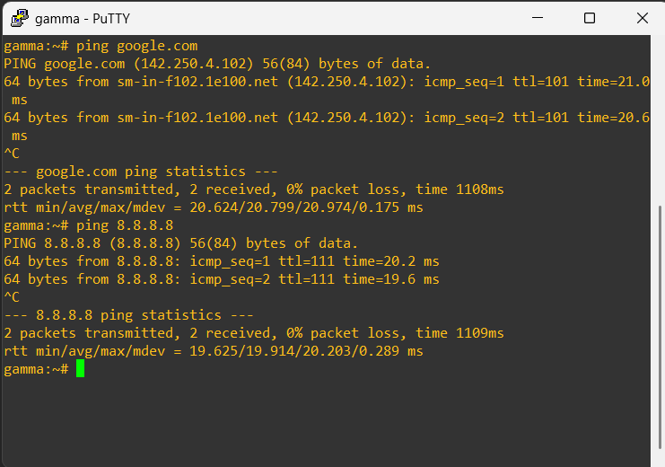

### 4. Konfigurasi Authoritative DNS Master dan Slave

Pada tahap ini, **Prab** dikonfigurasi sebagai authoritative DNS master untuk domain:

```text
k-03.com
```

sedangkan **Tedd** digunakan sebagai DNS slave.

IP yang digunakan:

```text
Prab : 10.65.2.3
Tedd : 10.65.2.2
Penny: 10.65.5.2
```

Pada Prab digunakan BIND sebagai DNS server. Konfigurasi utama zona dibuat dengan SOA yang menunjuk ke `prab.k-03.com`, serta NS record untuk Prab dan Tedd.

Contoh konfigurasi zona pada Prab:

```dns
$TTL 86400

@   IN  SOA prab.k-03.com. root.k-03.com. (
        2026092901
        3600
        1800
        604800
        86400
)

@       IN  NS      prab.k-03.com.
@       IN  NS      tedd.k-03.com.

@       IN  A       10.65.5.2
prab    IN  A       10.65.2.3
tedd    IN  A       10.65.2.2
```

Apex domain `k-03.com` diarahkan menuju Penny dengan IP `10.65.5.2`.

Pada Prab juga diaktifkan mekanisme `notify` dan `allow-transfer` agar perubahan zone dapat dikirimkan menuju Tedd:

```cfg
zone "k-03.com" {
    type master;
    file "db.k-03.com";

    notify yes;
    also-notify { 10.65.2.2; };
    allow-transfer { 10.65.2.2; };
};
```

Selain itu digunakan DNS forwarder:

```cfg
forwarders {
    192.168.122.1;
};
```

Pada Tedd, zona `k-03.com` dikonfigurasi sebagai slave:

```cfg
zone "k-03.com" {
    type slave;
    masters { 10.65.2.3; };
    file "slaves/db.k-03.com";
};
```

Resolver pada seluruh node non-router kemudian diubah menjadi:

```cfg
nameserver 10.65.2.3
nameserver 10.65.2.2
nameserver 192.168.122.1
```

Hasil verifikasi authoritative DNS slave pada Tedd:

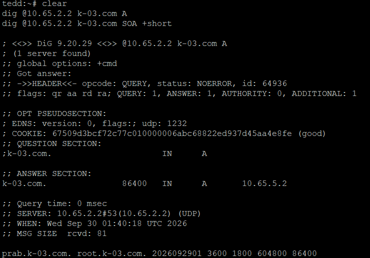

TEDD berhasil berfungsi sebagai authoritative DNS slave untuk zona `k-03.com`. Hal tersebut terlihat dari flag `aa`, A record `k-03.com` yang mengarah ke Penny (`10.65.5.2`), serta SOA yang menunjuk Prab sebagai DNS master.

Pengujian resolusi DNS dari Alpha:

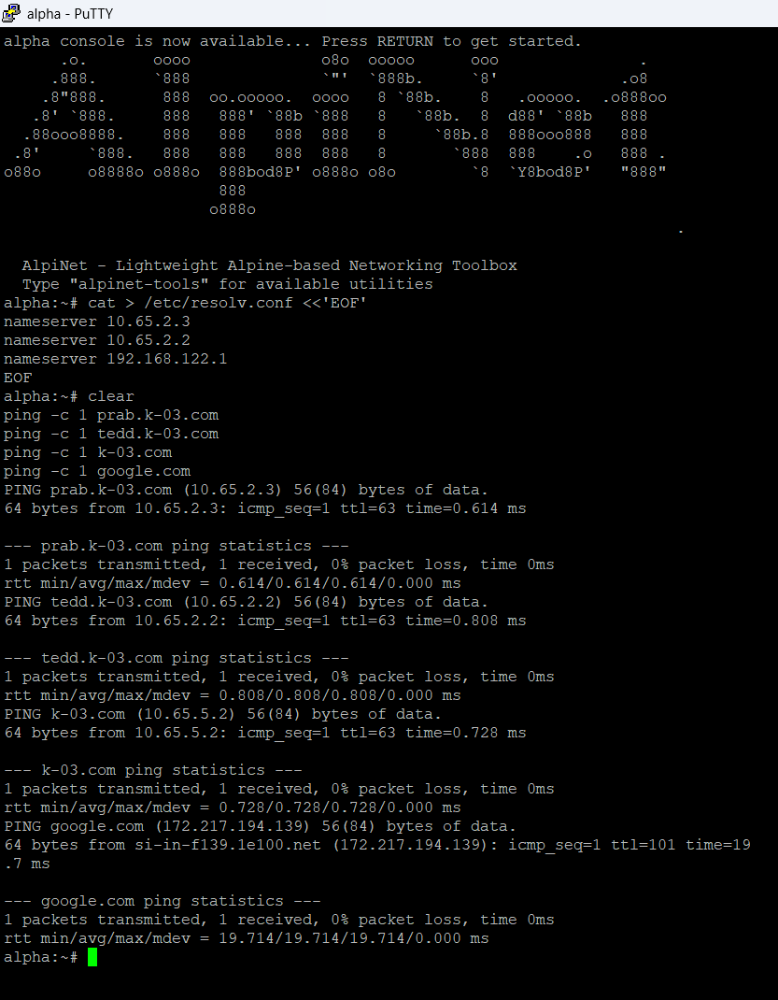

Client Alpha berhasil melakukan resolusi `prab.k-03.com`, `tedd.k-03.com`, dan `k-03.com`. Resolusi domain eksternal `google.com` juga berhasil, yang menunjukkan bahwa DNS internal dan forwarder telah berjalan dengan baik.

---

### 5. Konfigurasi Hostname dan A Record Seluruh Entitas

Setiap entitas kemudian diberikan hostname sesuai dengan nama node masing-masing dan dibuatkan A record pada domain `k-03.com`.

A record yang digunakan adalah:

```dns
rootkit IN  A       10.65.1.1

alpha   IN  A       10.65.6.2
beta    IN  A       10.65.6.3
gamma   IN  A       10.65.6.4

delta   IN  A       10.65.7.2
epsilon IN  A       10.65.7.3

prab    IN  A       10.65.2.3
tedd    IN  A       10.65.2.2

abbey   IN  A       10.65.4.2
penny   IN  A       10.65.5.2

obladi  IN  A       10.65.3.5
desmond IN  A       10.65.3.4
oblada  IN  A       10.65.3.3
molly   IN  A       10.65.3.2
```

Serial SOA dinaikkan menjadi:

```text
2026092902
```

Untuk Rootkit, hostname juga disesuaikan menjadi:

```bash
hostname rootkit
```

Hasil verifikasi A record melalui client Alpha:

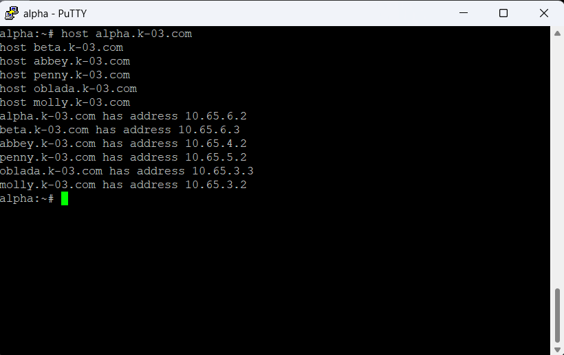

Pengujian menunjukkan beberapa hostname seperti Alpha, Beta, Abbey, Penny, Oblada, dan Molly berhasil di-resolve ke alamat IP masing-masing. Hal ini menunjukkan A record pada zona `k-03.com` telah bekerja sesuai konfigurasi.

---

### 6. Verifikasi Zone Transfer Prab ke Tedd

Untuk memastikan Tedd mendapatkan salinan zone terbaru dari Prab, dilakukan pemeriksaan serial SOA pada kedua DNS server.

Hasilnya:

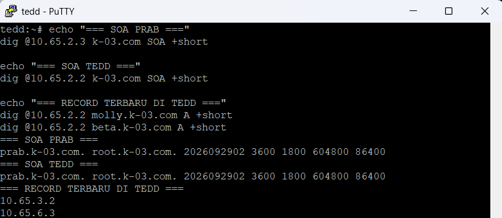

Prab dan Tedd memiliki serial SOA yang sama, yaitu:

```text
2026092902
```

Tedd juga berhasil menjawab record terbaru seperti:

```text
molly.k-03.com → 10.65.3.2
beta.k-03.com  → 10.65.6.3
```

Selain itu dilakukan pengujian AXFR dari Tedd menuju Prab:

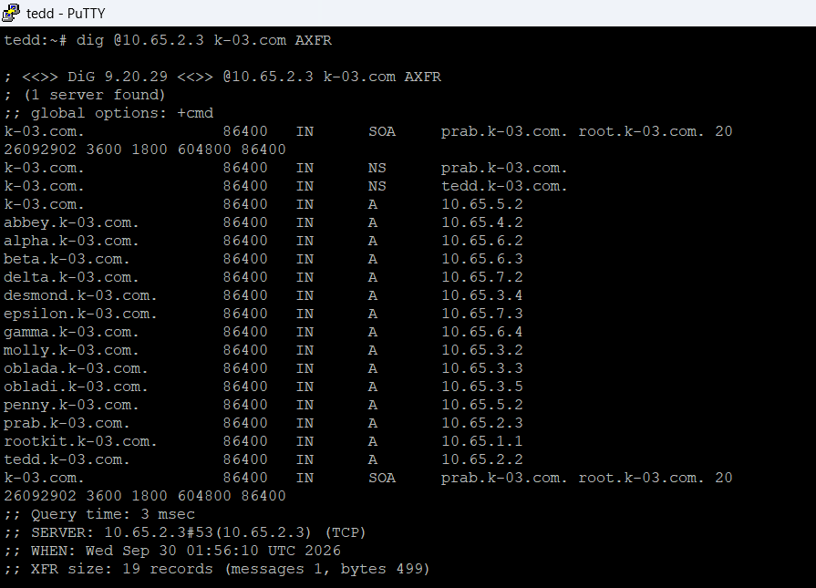

Hasil AXFR menampilkan seluruh record dalam zone `k-03.com` dengan:

```text
XFR size: 19 records
```

Hal tersebut menunjukkan mekanisme zone transfer dari DNS master menuju DNS slave telah berjalan dengan baik.

---

### 7. Konfigurasi Record Vault, Core, WWW, dan Static

Selanjutnya dibuat record untuk merepresentasikan kelompok layanan web statis dan dinamis.

Untuk area Vault:

```dns
vault   IN  A       10.65.3.5
vault   IN  A       10.65.3.4
```

Dengan:

```text
10.65.3.5 → Obladi
10.65.3.4 → Desmond
```

Untuk area Core:

```dns
core    IN  A       10.65.3.3
core    IN  A       10.65.3.2
```

Dengan:

```text
10.65.3.3 → Oblada
10.65.3.2 → Molly
```

Kemudian dibuat CNAME:

```dns
www     IN  CNAME   penny.k-03.com.
static  IN  CNAME   abbey.k-03.com.
```

Sehingga:

```text
www.k-03.com    → penny.k-03.com
static.k-03.com → abbey.k-03.com
```

Serial zona kemudian dinaikkan menjadi:

```text
2026092903
```

Pengujian dilakukan dari dua client yang berbeda.

Pengujian dari Alpha:

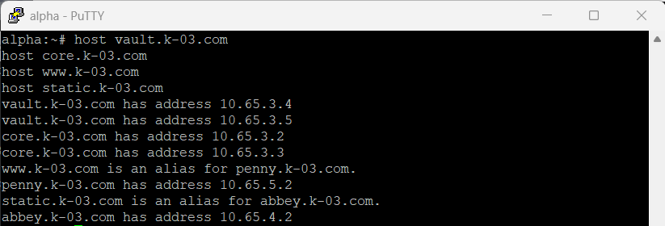

Pengujian dari Delta:

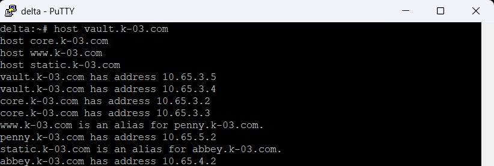

Hasil dari Alpha maupun Delta menunjukkan bahwa `vault.k-03.com` berhasil mengarah ke Obladi dan Desmond, sedangkan `core.k-03.com` mengarah ke Oblada dan Molly. CNAME `www.k-03.com` juga berhasil mengarah ke Penny dan `static.k-03.com` ke Abbey. Hasil tersebut menunjukkan resolusi DNS konsisten dari dua jaringan client yang berbeda.

---

### 8. Konfigurasi Reverse DNS

Reverse DNS dikonfigurasi untuk jaringan tempat Abbey, Penny, area Vault, dan area Core berada.

Karena node-node tersebut berada pada beberapa subnet, dibuat tiga reverse zone:

```text
10.65.3.0/24 → 3.65.10.in-addr.arpa
10.65.4.0/24 → 4.65.10.in-addr.arpa
10.65.5.0/24 → 5.65.10.in-addr.arpa
```

PTR record yang digunakan:

```dns
10.65.4.2 → abbey.k-03.com.
10.65.5.2 → penny.k-03.com.

10.65.3.5 → vault.k-03.com.
10.65.3.4 → vault.k-03.com.

10.65.3.3 → core.k-03.com.
10.65.3.2 → core.k-03.com.
```

Contoh reverse zone untuk area Core dan Vault:

```dns
$TTL 86400

@   IN SOA prab.k-03.com. root.k-03.com. (
        2026093001
        3600
        1800
        604800
        86400
)

@   IN NS prab.k-03.com.
@   IN NS tedd.k-03.com.

2   IN PTR core.k-03.com.
3   IN PTR core.k-03.com.
4   IN PTR vault.k-03.com.
5   IN PTR vault.k-03.com.
```

PRAB dikonfigurasi sebagai master dari ketiga reverse zone dan TEDD sebagai slave.

Hasil validasi reverse zone pada Prab:

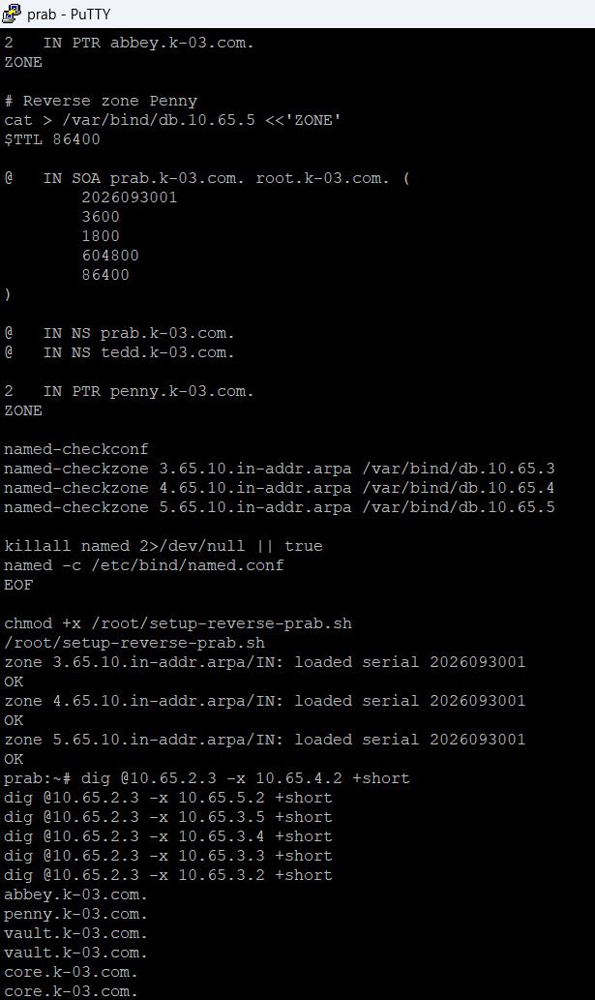

Ketiga reverse zone berhasil dimuat dengan status `OK`, dan reverse lookup berhasil mengembalikan hostname Abbey, Penny, Vault, dan Core.

Selanjutnya dilakukan pengujian melalui Tedd:

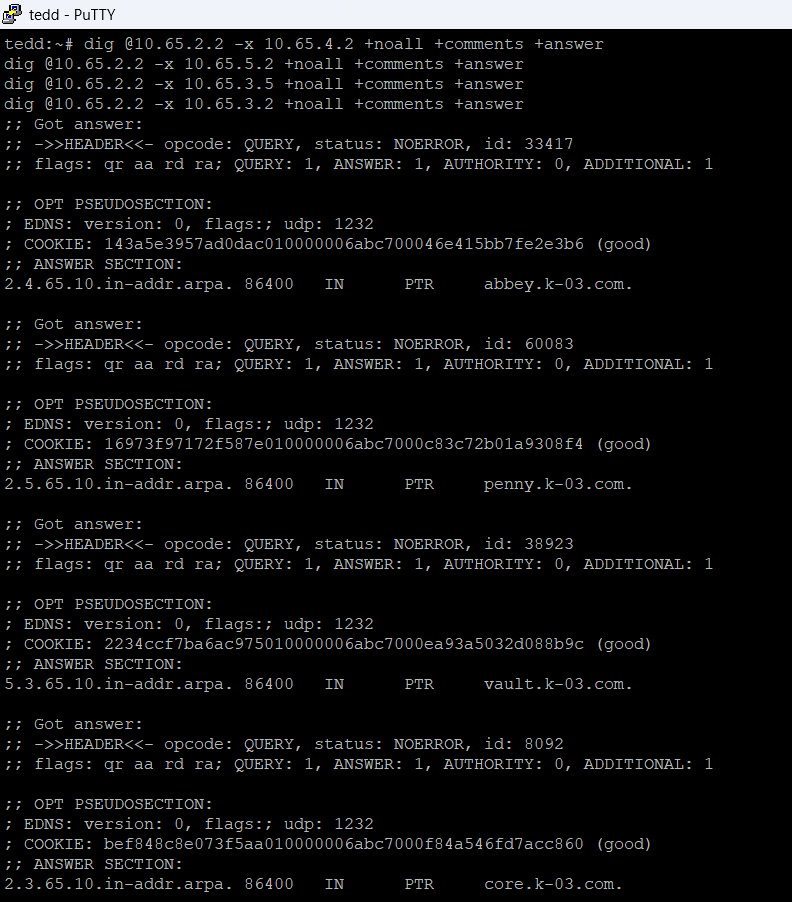

Tedd berhasil menjawab reverse query dengan status `NOERROR` dan flag `aa`, sehingga dapat disimpulkan bahwa reverse zone telah berhasil ditransfer ke DNS slave dan dapat dijawab secara authoritative.

---

### 9. Web Statis pada Area Vault

Area Vault terdiri dari:

```text
Obladi  → 10.65.3.5
Desmond → 10.65.3.4
```

Kedua node menjalankan layanan web statis menggunakan Apache.

Pada masing-masing server dibuat direktori:

```text
/var/www/localhost/htdocs/arsip
```

Kemudian directory listing diaktifkan menggunakan:

```apache
<Directory "/var/www/localhost/htdocs/arsip">
    Options +Indexes
    AllowOverride None
    Require all granted
</Directory>
```

Pada Obladi dibuat beberapa file:

```text
dokumen-vault.txt
network-info.txt
obladi.txt
```

Pengujian dilakukan menggunakan hostname:

```bash
curl http://obladi.k-03.com/arsip/
```

Hasil:

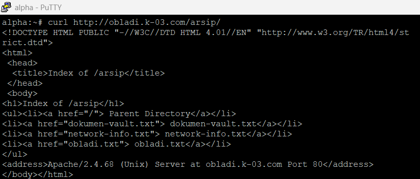

Directory listing pada Obladi berhasil menampilkan seluruh file pada direktori `/arsip/`.

Pada Desmond dibuat:

```text
desmond.txt
dokumen-vault.txt
network-info.txt
```

Pengujian:

```bash
curl http://desmond.k-03.com/arsip/
```

Hasil:

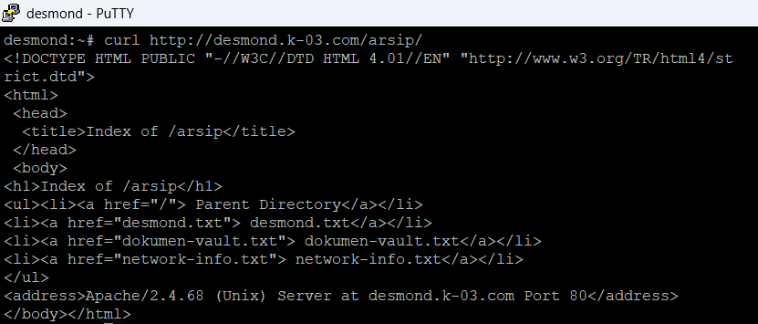

Directory listing pada Desmond juga berhasil berjalan. Dengan demikian, kedua node area Vault mampu menyediakan layanan web statis melalui hostname masing-masing tanpa menggunakan alamat IP secara langsung.

---

### 10. Web Dinamis pada Area Core

Area Core terdiri dari:

```text
Oblada → 10.65.3.3
Molly  → 10.65.3.2
```

Kedua node dikonfigurasi menggunakan:

```text
Nginx
PHP 8.4
PHP-FPM
```

Aplikasi sederhana dibuat pada:

```text
/var/www/core/index.php
/var/www/core/profil.php
```

Halaman utama menampilkan halaman Beranda, sedangkan `profil.php` digunakan sebagai halaman Profil.

Nginx dikonfigurasi agar file PHP diproses melalui PHP-FPM:

```nginx
location ~ \.php$ {
    include fastcgi_params;
    fastcgi_param SCRIPT_FILENAME $document_root$fastcgi_script_name;
    fastcgi_pass 127.0.0.1:9000;
}
```

Selain itu diterapkan rewrite:

```nginx
rewrite ^/profil/?$ /profil.php last;
```

Sehingga halaman Profil dapat diakses menggunakan:

```text
/profil
```

tanpa perlu menambahkan ekstensi `.php`.

Pada saat pengujian ditemukan bahwa link GNS3 milik Oblada terhubung dari Switch3 menuju interface `eth1`. Oleh karena itu IP Oblada `10.65.3.3/24` dipasang pada `eth1` agar dapat berkomunikasi dengan jaringan area Core.

Pengujian akhir dilakukan dari client Alpha:

```bash
curl http://oblada.k-03.com/
curl http://oblada.k-03.com/profil

curl http://molly.k-03.com/
curl http://molly.k-03.com/profil
```

Hasil:

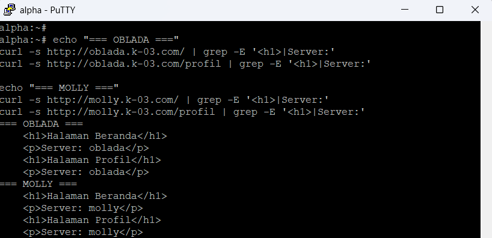

Pengujian menunjukkan bahwa Oblada dan Molly berhasil menjalankan layanan web dinamis menggunakan Nginx dan PHP-FPM. Halaman Beranda dan Profil dapat ditampilkan pada kedua server, serta identitas server masing-masing berhasil ditampilkan melalui PHP. Path `/profil` juga dapat diakses tanpa ekstensi `.php`, sehingga konfigurasi rewrite telah berjalan sesuai requirement.

11. Konfigurasikan Penny (menggunakan Apache) sebagai reverse proxy yang mengarah ke semua node di area vault (Obladi & Desmond). Sementara itu, konfigurasikan Abbey (menggunakan Nginx) sebagai reverse proxy menuju area core (Oblada & Molly). Pastikan kedua gerbang ini meneruskan identitas asli pengunjung ke server backend dengan melakukan forwarding header Host dan X-Real-IP. Buktikan bahwa Penny dan Abbey berhasil mendistribusikan lalu lintas dengan tepat.

Untuk scriptnya seperti berikut

[setup-abbey.sh](./src/soal-11/setup-abbey.sh)

```sh
#!/bin/sh

DOMAIN="k-03.com"
CORE1="10.65.3.3"       # oblada
CORE2="10.65.3.2"       # molly

[ "$(id -u)" = "0" ] || { echo "Jalankan sebagai root"; exit 1; }

start_svc() {
    if command -v rc-service >/dev/null 2>&1; then
        rc-update add "$1" default
        rc-service "$1" restart
    else
        echo "(OpenRC tidak ada, $1 dijalankan manual)"
        eval "$2"
    fi
}

echo "[1/3] Install nginx..."
apk update
apk add nginx || { echo "Gagal apk add (cek DNS/internet)"; exit 1; }

echo "[2/3] Tulis konfigurasi proxy..."
rm -f /etc/nginx/http.d/default.conf

cat > /etc/nginx/http.d/abbey.conf <<'EOF'
upstream core_backend {
    server @CORE1@:80;
    server @CORE2@:80;
}

server {
    listen 80 default_server;
    server_name static.@DOMAIN@ abbey.@DOMAIN@ _;

    location / {
        proxy_pass http://core_backend;
        # Meneruskan header Host asli dan IP asli pengunjung
        proxy_set_header Host $host;
        proxy_set_header X-Real-IP $remote_addr;
        proxy_set_header X-Forwarded-For $proxy_add_x_forwarded_for;
        # Bukti distribusi: backend mana yang melayani (terlihat di respons)
        add_header X-Served-By $upstream_addr always;
    }
}
EOF

sed -i \
    -e "s/@DOMAIN@/${DOMAIN}/g" \
    -e "s/@CORE1@/${CORE1}/g" \
    -e "s/@CORE2@/${CORE2}/g" \
    /etc/nginx/http.d/abbey.conf

echo "[3/3] Validasi, restart, autostart..."
nginx -t || exit 1
killall nginx 2>/dev/null
sleep 1
mkdir -p /run/nginx
start_svc nginx "nginx"

echo
echo "Verifikasi (lokal di abbey)"
sleep 2
echo "6 request ke abbey. Header X-Served-By harus bergantian 10.65.3.3 / 10.65.3.2:"
for i in 1 2 3 4 5 6; do
    OUT=$(curl -s -m 5 -o /dev/null -D - -H "Host: static.${DOMAIN}" http://127.0.0.1/ \
          | grep -iE '^HTTP|^X-Served-By' | tr -d '\r' | tr '\n' ' ')
    echo "${OUT:-(tidak ada respons - cek: ps | grep nginx)}"
done
echo
echo "Kalau HTTP 502: backend tidak terjangkau. Tes langsung:"
echo "  curl -I http://${CORE1}/   dan   curl -I http://${CORE2}/" #kalau misal gk work...
```

[setup-penny.sh](./src/soal-11/setup-penny.sh)

```sh
#!/bin/sh

DOMAIN="k-03.com"
VAULT1="10.65.3.5"      # obladi
VAULT2="10.65.3.4"      # desmond

[ "$(id -u)" = "0" ] || { echo "Jalankan sebagai root"; exit 1; }

start_svc() {
    if command -v rc-service >/dev/null 2>&1; then
        rc-update add "$1" default
        rc-service "$1" restart
    else
        echo "(OpenRC tidak ada, $1 dijalankan manual)"
        eval "$2"
    fi
}

echo "[1/4] Install Apache + modul proxy..."
apk update
apk add apache2 apache2-proxy || { echo "Gagal apk add (cek DNS/internet)"; exit 1; }

echo "[2/4] Aktifkan modul..."
enable_mod() {
    if grep -rqE "^[[:space:]]*LoadModule $1 " /etc/apache2/; then return; fi
    if grep -qE "^#[[:space:]]*LoadModule $1 " /etc/apache2/httpd.conf; then
        sed -i -E "s|^#[[:space:]]*(LoadModule $1 .*)|\1|" /etc/apache2/httpd.conf
    else
        echo "LoadModule $1 modules/$2" >> /etc/apache2/conf.d/00-modules-mesh.conf
    fi
}
while read -r name file; do
    enable_mod "$name" "$file"
done <<EOF
proxy_module mod_proxy.so
proxy_http_module mod_proxy_http.so
proxy_balancer_module mod_proxy_balancer.so
lbmethod_byrequests_module mod_lbmethod_byrequests.so
slotmem_shm_module mod_slotmem_shm.so
headers_module mod_headers.so
EOF

echo "[3/4] Tulis konfigurasi proxy..."
cat > /etc/apache2/conf.d/penny-proxy.conf <<'EOF'
ServerName penny.@DOMAIN@

<Proxy "balancer://vault">
    BalancerMember "http://@V1@:80"
    BalancerMember "http://@V2@:80"
    ProxySet lbmethod=byrequests
</Proxy>

<VirtualHost *:80>
    ServerName www.@DOMAIN@
    ServerAlias @DOMAIN@

    ProxyRequests Off
    # Meneruskan header Host asli (bukan alamat backend)
    ProxyPreserveHost On
    # Meneruskan IP asli pengunjung
    RequestHeader set X-Real-IP "expr=%{REMOTE_ADDR}"
    # Bukti distribusi: backend mana yang melayani (terlihat di respons)
    Header always set X-Served-By "%{BALANCER_WORKER_NAME}e"

    ProxyPass / balancer://vault/
    ProxyPassReverse / balancer://vault/
</VirtualHost>
EOF

sed -i \
    -e "s/@DOMAIN@/${DOMAIN}/g" \
    -e "s/@V1@/${VAULT1}/g" \
    -e "s/@V2@/${VAULT2}/g" \
    /etc/apache2/conf.d/penny-proxy.conf

echo "[4/4] Validasi, restart, autostart..."
httpd -t || exit 1
killall httpd 2>/dev/null
sleep 1
rm -f /run/apache2/httpd.pid
mkdir -p /run/apache2
start_svc apache2 "httpd"

echo
echo "Verifikasi (lokal di penny)"
sleep 2
echo "6 request ke penny. Header X-Served-By harus bergantian 10.65.3.5 / 10.65.3.4:"
for i in 1 2 3 4 5 6; do
    OUT=$(curl -s -m 5 -o /dev/null -D - -H "Host: www.${DOMAIN}" http://127.0.0.1/ \
          | grep -iE '^HTTP|^X-Served-By' | tr -d '\r' | tr '\n' ' ')
    echo "${OUT:-(tidak ada respons - cek: ps | grep httpd)}"
done
echo
echo "Kalau HTTP 502/503: backend tidak terjangkau. Tes langsung:"
echo "  curl -I http://${VAULT1}/   dan   curl -I http://${VAULT2}/" #kalau misal gk work...
```

Dan menambahkan ke obladi dan desmond dengan

```sh
#!/bin/sh

[ "$(id -u)" = "0" ] || { echo "Jalankan sebagai root"; exit 1; }

echo 'LogFormat "%{Host}i %{X-Real-IP}i" hdr' > /etc/apache2/conf.d/hdr.conf
echo 'CustomLog /var/log/apache2/hdr.log hdr' >> /etc/apache2/conf.d/hdr.conf

if httpd -t; then
    killall httpd 2>/dev/null
    sleep 1
    rm -f /run/apache2/httpd.pid
    httpd
else
    echo "Config Apache error, httpd tidak di-restart"; exit 1
fi

echo
echo "Selesai. Dari client (alpha) jalankan:  curl http://www.k-03.com/"
echo "Lalu di node ini:  tail /var/log/apache2/hdr.log"
echo "Harus muncul:  www.k-03.com <IP client>   (bukan IP penny)"

```

pada configurasinya untuk prove. Hasilnya ketika kita melakukan

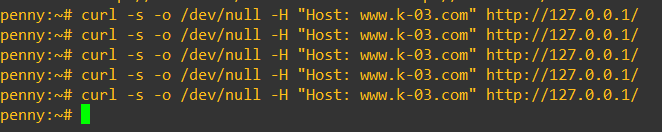

maka di obladi:

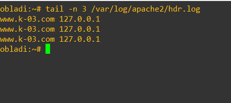

(ini sebelumnya saya test dulu dan berhasil ternyata) dan di desmond:

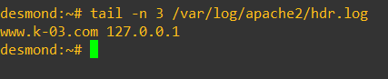

Dan kalau di alpha hasilnya:

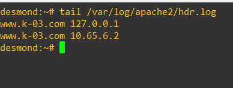
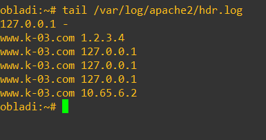

Script setup: [setup-vault.sh](./src/soal-11/setup-vault.sh)

Untuk yang oblada dan molly, berikut:

```sh
#!/bin/sh

[ "$(id -u)" = "0" ] || { echo "Jalankan sebagai root"; exit 1; }

CONF=/etc/nginx/http.d/core.conf
if [ -f "$CONF" ] && ! grep -q 'static.k-03.com' "$CONF"; then
    sed -i 's/^\([[:space:]]*server_name\)\(.*\);/\1\2 static.k-03.com;/' "$CONF"
fi

cat > /etc/nginx/http.d/hdr.conf <<'EOF'
log_format hdr '$host $http_x_real_ip';
access_log /var/log/nginx/hdr.log hdr;
EOF

if nginx -t; then
    nginx -s reload 2>/dev/null || { mkdir -p /run/nginx; nginx; }
else
    echo "Config nginx error"; exit 1
fi

echo
echo "Selesai. Dari client (alpha) jalankan:  curl http://static.k-03.com/"
echo "Lalu di node ini:  tail /var/log/nginx/hdr.log"
echo "Harus muncul:  static.k-03.com <IP client>   (bukan IP abbey)"
```

Hasilnya seperti berikut:

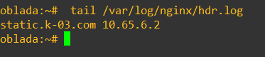
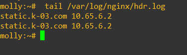

12. 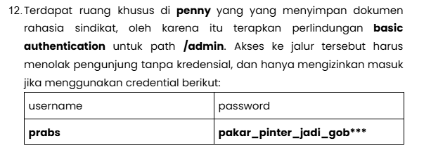

Diminta untuk membuat creds dalam penny. untuk script yang saya gunakan adalah:

```sh
#!/bin/sh

[ "$(id -u)" = "0" ] || { echo "Jalankan sebagai root"; exit 1; }

DOMAIN="k-03.com"
AUTH_USER="prabs"
AUTH_PASS='pakar_pinter_jadi_gob***'
HTPASSWD="/etc/apache2/.htpasswd"
CONF="/etc/apache2/conf.d/penny-proxy.conf"

enable_mod() {
    if grep -rqE "^[[:space:]]*LoadModule $1 " /etc/apache2/; then return; fi
    if grep -qE "^#[[:space:]]*LoadModule $1 " /etc/apache2/httpd.conf; then
        sed -i -E "s|^#[[:space:]]*(LoadModule $1 .*)|\1|" /etc/apache2/httpd.conf
    else
        echo "LoadModule $1 modules/$2" >> /etc/apache2/conf.d/00-modules-mesh.conf
    fi
}

echo "[1/5] Install paket..."
apk update
apk add apache2 apache2-utils curl || { echo "Gagal apk add"; exit 1; }

echo "[2/5] Aktifkan modul auth..."
enable_mod alias_module mod_alias.so
enable_mod authn_file_module mod_authn_file.so
enable_mod auth_basic_module mod_auth_basic.so
enable_mod authz_user_module mod_authz_user.so

echo "[3/5] Buat user & halaman rahasia..."
htpasswd -bc "$HTPASSWD" "$AUTH_USER" "$AUTH_PASS"
chgrp apache "$HTPASSWD" 2>/dev/null
chmod 640 "$HTPASSWD"

mkdir -p /var/www/admin
cat > /var/www/admin/index.html <<'EOF'
<!DOCTYPE html>
<html><head><title>Admin</title></head>
<body><h1>Ruang Rahasia Sindikat</h1><p>Dokumen rahasia - hanya untuk admin.</p></body></html>
EOF
chmod -R a+rX /var/www/admin

echo "[4/5] Tulis konfigurasi /admin..."
[ -f "$CONF" ] || { echo "$CONF belum ada. Jalankan soal-11/setup-penny.sh dulu"; exit 1; }
mkdir -p /etc/apache2/conf.d/penny-vhost.d
if ! grep -q 'penny-vhost.d' "$CONF"; then
    awk '/ProxyPass \/ balancer/ && !d {print "    IncludeOptional /etc/apache2/conf.d/penny-vhost.d/*.inc"; d=1} {print}' \
        "$CONF" > "$CONF.new" && mv "$CONF.new" "$CONF"
fi

cat > /etc/apache2/conf.d/penny-vhost.d/admin.inc <<EOF
# /admin dilayani lokal oleh penny (tidak diproxy) + basic auth
ProxyPass /admin !
Alias /admin /var/www/admin
<Directory "/var/www/admin">
    AuthType Basic
    AuthName "Ruang Rahasia Sindikat"
    AuthUserFile $HTPASSWD
    Require valid-user
    Options None
    AllowOverride None
</Directory>
EOF

echo "[5/5] Validasi & restart Apache..."
httpd -t || exit 1
killall httpd 2>/dev/null
sleep 1
rm -f /run/apache2/httpd.pid
mkdir -p /run/apache2
httpd
sleep 2

echo
echo "=== VERIFIKASI ==="
code() { curl -s -o /dev/null -w '%{http_code}' -H "Host: www.$DOMAIN" "$@"; }
echo "Tanpa kredensial   (harus 401): $(code http://127.0.0.1/admin/)"
echo "Password salah     (harus 401): $(code -u "$AUTH_USER:salah" http://127.0.0.1/admin/)"
echo "Kredensial benar   (harus 200): $(code -u "$AUTH_USER:$AUTH_PASS" http://127.0.0.1/admin/)"
echo
echo "Dari client:  curl -i http://www.$DOMAIN/admin/"
echo "              curl -u 'prabs:pakar_pinter_jadi_gob***' http://www.$DOMAIN/admin/"
```

[creds.sh](./src/soal-12/creds.sh)

Untuk membuktikan bahwa apakah ini unauthorized atau tidak disediakan opsi buat curl kalau belum login pakai creds maupun yang pakai creds. Hasilnya:

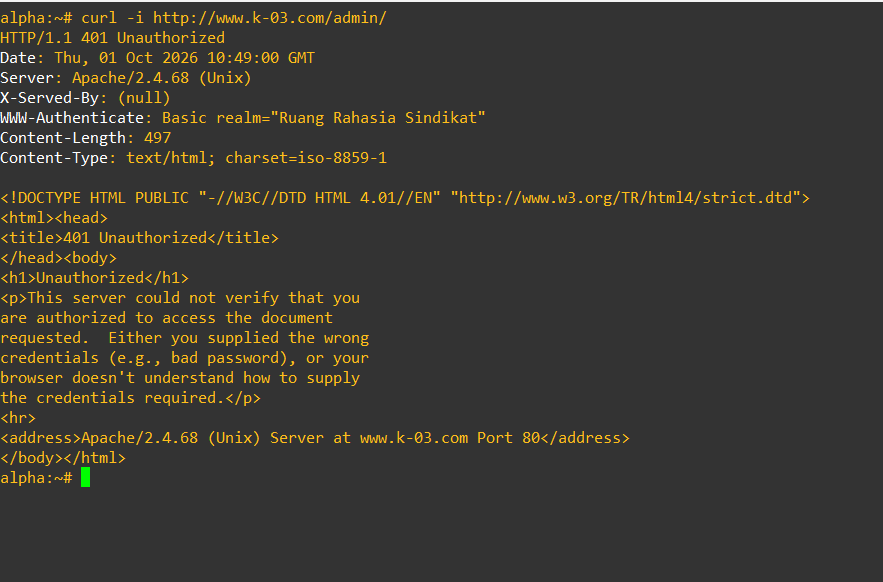

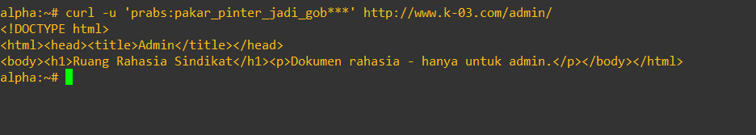

13. Setiap entitas dari luar harus memanggil gerbang dengan nama kanoniknya. Jika ada yang mencoba mengakses IP penny dan domain  penny.xxx.com, paksa sistem untuk melakukan redirect secara permanen (status code 301) menuju www.xxx.com. Sebaliknya, jika ada yang mengakses IP abbey dan domain abbey.xxx.com, lakukan redirect sementara (status code 302) menuju static.xxx.com.

Script untuk no 13:

```sh
#!/bin/sh

[ "$(id -u)" = "0" ] || { echo "Jalankan sebagai root"; exit 1; }

DOMAIN="k-03.com"
ROLE="${1:-$(hostname)}"
IPS="$(ip -4 -o addr show scope global | awk '{print $4}' | cut -d/ -f1 | tr '\n' ' ')"

case "$ROLE" in
penny)
    echo "[PENNY] IP node: $IPS"
    [ -f /etc/apache2/conf.d/penny-proxy.conf ] || { echo "Jalankan soal-11/setup-penny.sh dulu"; exit 1; }

    cat > /etc/apache2/conf.d/penny-redirect.conf <<EOF
<VirtualHost *:80>
    ServerName penny.$DOMAIN
    ServerAlias $IPS
    Redirect permanent / http://www.$DOMAIN/
</VirtualHost>
EOF

    httpd -t || exit 1
    killall httpd 2>/dev/null
    sleep 1
    rm -f /run/apache2/httpd.pid
    mkdir -p /run/apache2
    httpd
    sleep 2

    echo
    echo "VERIFIKASI (harus 301 + Location: http://www.$DOMAIN/)"
    for H in penny.$DOMAIN $IPS; do
        echo "--- Host: $H"
        curl -s -I -H "Host: $H" http://127.0.0.1/ | grep -iE '^HTTP|^Location'
    done
    echo "--- Host: www.$DOMAIN (harus TIDAK redirect)"
    curl -s -I -H "Host: www.$DOMAIN" http://127.0.0.1/ | grep -iE '^HTTP|^Location'
    ;;

abbey)
    echo "[ABBEY] IP node: $IPS"
    [ -f /etc/nginx/http.d/abbey.conf ] || { echo "Jalankan soal-11/setup-abbey.sh dulu"; exit 1; }

    sed -i "s/ abbey\.$DOMAIN//" /etc/nginx/http.d/abbey.conf

    cat > /etc/nginx/http.d/abbey-redirect.conf <<EOF
server {
    listen 80;
    server_name abbey.$DOMAIN $IPS;
    return 302 http://static.$DOMAIN\$request_uri;
}
EOF

    nginx -t || exit 1
    nginx -s reload 2>/dev/null || { mkdir -p /run/nginx; nginx; }
    sleep 1

    echo
    echo "=== VERIFIKASI (harus 302 + Location: http://static.$DOMAIN/) ==="
    for H in abbey.$DOMAIN $IPS; do
        echo "--- Host: $H"
        curl -s -I -H "Host: $H" http://127.0.0.1/ | grep -iE '^HTTP|^Location'
    done
    ;;

*)
    echo "Pakai: sh script.sh penny|abbey"
    exit 1
    ;;
esac
```

Hasilnya sebagai berikut:

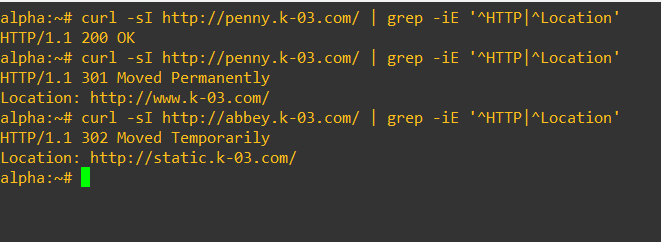

14. Di dalam The Mesh, rekam jejak tidak boleh dipalsukan oleh sistem. Pastikan access log pada setiap server web di area vault maupun area core mencatat alamat IP asli milik client (pengunjung) yang diteruskan oleh gerbang, dan bukan mencatat IP dari Penny ataupun Abbey.

Untuk script yang saya pakai hanya 1 dan itu bisa melihat apakah dia menggunakan nginx atau apache adalah sebagai berikut:

```sh
#!/bin/sh

[ "$(id -u)" = "0" ] || { echo "Jalankan sebagai root"; exit 1; }

ROLE="${1:-$(hostname)}"
case "$ROLE" in obladi|desmond) ROLE=vault ;; oblada|molly) ROLE=core ;; esac

case "$ROLE" in
vault)
    enable_mod() {
        if grep -rqE "^[[:space:]]*LoadModule $1 " /etc/apache2/; then return; fi
        if grep -qE "^#[[:space:]]*LoadModule $1 " /etc/apache2/httpd.conf; then
            sed -i -E "s|^#[[:space:]]*(LoadModule $1 .*)|\1|" /etc/apache2/httpd.conf
        else
            echo "LoadModule $1 modules/$2" >> /etc/apache2/conf.d/00-modules-mesh.conf
        fi
    }
    enable_mod remoteip_module mod_remoteip.so

    cat > /etc/apache2/conf.d/realip.conf <<'EOF'
RemoteIPHeader X-Real-IP
RemoteIPInternalProxy 10.65.4.0/24 10.65.5.0/24
EOF

    sed -i 's/^\([[:space:]]*LogFormat "\)%h /\1%a /' /etc/apache2/httpd.conf

    httpd -t || exit 1
    killall httpd 2>/dev/null
    sleep 1
    rm -f /run/apache2/httpd.pid
    mkdir -p /run/apache2
    httpd
    echo
    echo "Selesai (vault). client: curl http://www.k-03.com/"
    echo "Cek: tail /var/log/apache2/access.log"
    ;;

core)
    cat > /etc/nginx/http.d/realip.conf <<'EOF'
set_real_ip_from 10.65.4.0/24;
set_real_ip_from 10.65.5.0/24;
real_ip_header X-Real-IP;
EOF

    nginx -t || exit 1
    nginx -s reload 2>/dev/null || { mkdir -p /run/nginx; nginx; }
    echo
    echo "Selesai. client: curl http://static.k-03.com/"
    echo "Cek: tail /var/log/nginx/access.log"
    ;;

*)
    exit 1
    ;;
esac
```

Hasilnya saat saya coba:

Percobaan 1:

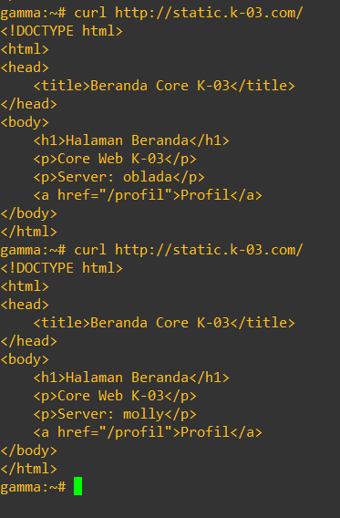

Result:

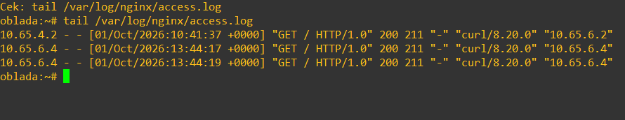
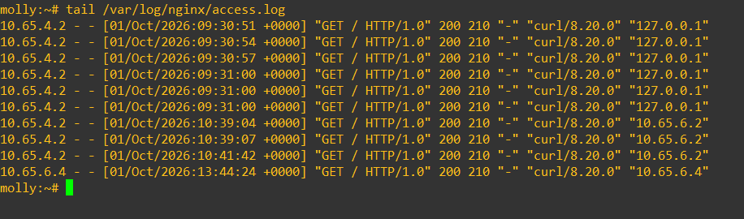

Percobaan 2:

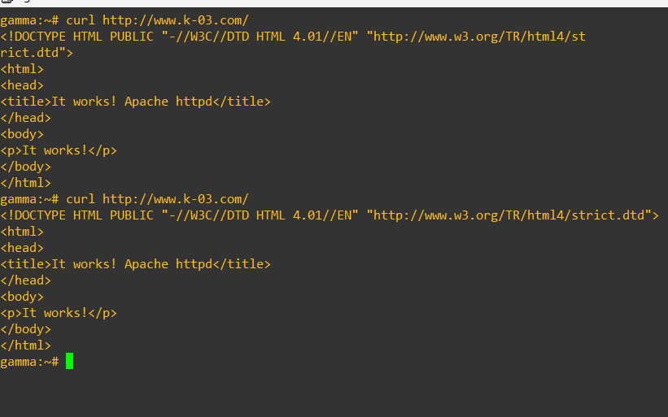

Result:

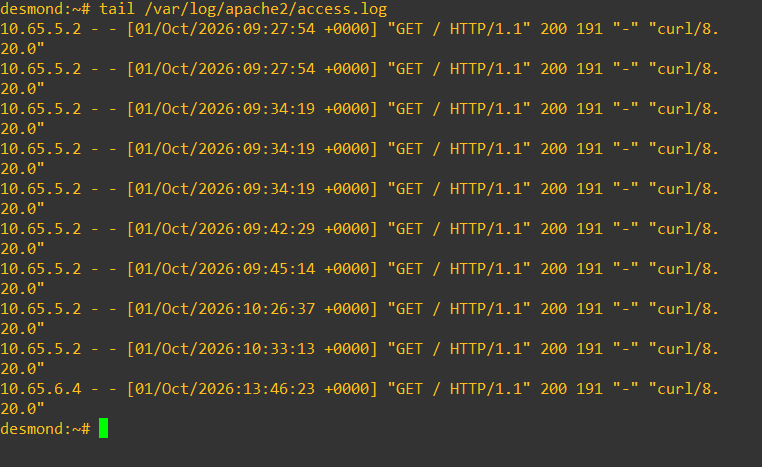
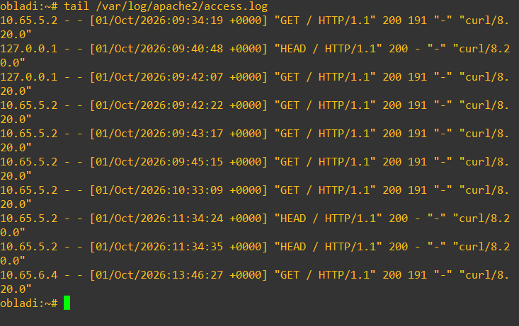

15. Rootkit menginstruksikan pembuatan jalur proxy khusus yang berdiri sendiri. Pada penny buat reverse proxy untuk path /eternal yang menyajikan directory /var/www/eternal, dan pastikan path ini dapat mengeksekusi (rendering) file php. Pada abbey, buat jalur /orion yang menyajikan directory /var/www/orion, secara murni statis tanpa perlu rendering php.

Scriptnya hanya 1:

```sh
#!/bin/sh

[ "$(id -u)" = "0" ] || { echo "Jalankan sebagai root"; exit 1; }

DOMAIN="k-03.com"
ROLE="${1:-$(hostname)}"

case "$ROLE" in
penny)
    CONF="/etc/apache2/conf.d/penny-proxy.conf"
    [ -f "$CONF" ] || { echo "Jalankan soal-11/setup-penny.sh dulu"; exit 1; }

    enable_mod() {
        if grep -rqE "^[[:space:]]*LoadModule $1 " /etc/apache2/; then return; fi
        if grep -qE "^#[[:space:]]*LoadModule $1 " /etc/apache2/httpd.conf; then
            sed -i -E "s|^#[[:space:]]*(LoadModule $1 .*)|\1|" /etc/apache2/httpd.conf
        else
            echo "LoadModule $1 modules/$2" >> /etc/apache2/conf.d/00-modules-mesh.conf
        fi
    }

    echo "[1/4] Install PHP-FPM..."
    apk update
    apk add apache2 apache2-proxy php84 php84-fpm curl || { echo "Gagal apk add"; exit 1; }

    enable_mod alias_module mod_alias.so
    enable_mod proxy_module mod_proxy.so
    enable_mod proxy_fcgi_module mod_proxy_fcgi.so

    echo "[2/4] Buat aplikasi /var/www/eternal..."
    mkdir -p /var/www/eternal
    cat > /var/www/eternal/index.php <<'EOF'
<!DOCTYPE html>
<html><head><title>Eternal</title></head>
<body>
<h1>Eternal (PHP aktif)</h1>
<p>Server: <?php echo gethostname(); ?></p>
<p>PHP versi: <?php echo PHP_VERSION; ?></p>
<p>Waktu server: <?php echo date('Y-m-d H:i:s'); ?></p>
</body></html>
EOF
    chmod -R a+rX /var/www/eternal

    sed -i 's|^listen = .*|listen = 127.0.0.1:9000|' /etc/php84/php-fpm.d/www.conf

    echo "[3/4] Tulis konfigurasi /eternal..."
    mkdir -p /etc/apache2/conf.d/penny-vhost.d
    if ! grep -q 'penny-vhost.d' "$CONF"; then
        awk '/ProxyPass \/ balancer/ && !d {print "    IncludeOptional /etc/apache2/conf.d/penny-vhost.d/*.inc"; d=1} {print}' \
            "$CONF" > "$CONF.new" && mv "$CONF.new" "$CONF"
    fi

    cat > /etc/apache2/conf.d/penny-vhost.d/eternal.inc <<'EOF'
# /eternal berdiri sendiri: tidak diproxy ke vault, PHP dirender via PHP-FPM
ProxyPass /eternal !
Alias /eternal /var/www/eternal
<Directory "/var/www/eternal">
    Options None
    AllowOverride None
    Require all granted
    DirectoryIndex index.php index.html
    <FilesMatch "\.php$">
        SetHandler "proxy:fcgi://127.0.0.1:9000"
    </FilesMatch>
</Directory>
EOF

    echo "[4/4] Validasi & jalankan layanan..."
    php-fpm84 -t || exit 1
    httpd -t || exit 1
    killall php-fpm84 2>/dev/null
    sleep 1
    php-fpm84
    killall httpd 2>/dev/null
    sleep 1
    rm -f /run/apache2/httpd.pid
    mkdir -p /run/apache2
    httpd
    sleep 2

    echo
    echo "=== VERIFIKASI (harus tampil 'PHP aktif' & versi PHP, BUKAN tag <?php) ==="
    curl -s -H "Host: www.$DOMAIN" http://127.0.0.1/eternal/
    echo
    echo "Dari client: curl http://www.$DOMAIN/eternal/"
    ;;

abbey)
    CONF="/etc/nginx/http.d/abbey.conf"
    [ -f "$CONF" ] || { echo "Jalankan soal-11/setup-abbey.sh dulu"; exit 1; }

    echo "[1/3] Buat konten statis /var/www/orion..."
    mkdir -p /var/www/orion
    cat > /var/www/orion/index.html <<'EOF'
<!DOCTYPE html>
<html><head><title>Orion</title></head>
<body><h1>Orion (statis)</h1><p>Dilayani langsung oleh Abbey, tanpa PHP.</p></body></html>
EOF
    echo "File statis Orion" > /var/www/orion/info.txt
    chmod -R a+rX /var/www/orion

    echo "[2/3] Tulis konfigurasi /orion..."
    mkdir -p /etc/nginx/abbey.d
    if ! grep -q 'abbey.d' "$CONF"; then
        awk '/^[[:space:]]*server_name/ && !d {print; print "    include /etc/nginx/abbey.d/*.conf;"; d=1; next} {print}' \
            "$CONF" > "$CONF.new" && mv "$CONF.new" "$CONF"
    fi

    cat > /etc/nginx/abbey.d/orion.conf <<'EOF'
location = /orion {
    return 301 $scheme://$host/orion/;
}
location /orion/ {
    alias /var/www/orion/;
    index index.html;
}
EOF

    echo "[3/3] Validasi & reload nginx..."
    nginx -t || exit 1
    nginx -s reload 2>/dev/null || { mkdir -p /run/nginx; nginx; }
    sleep 1

    echo
    echo "=== VERIFIKASI ==="
    curl -s -H "Host: static.$DOMAIN" http://127.0.0.1/orion/
    echo
    curl -s -H "Host: static.$DOMAIN" http://127.0.0.1/orion/info.txt
    echo
    echo "Dari client: curl http://static.$DOMAIN/orion/"
    ;;

*)
    echo "Pakai: sh script.sh penny|abbey"
    exit 1
    ;;
esac
```

Jadi ini mendeteksi apakah dia abbey atau dia adalah penny. Maka dari sini hasil keduanya sebagai berikut:

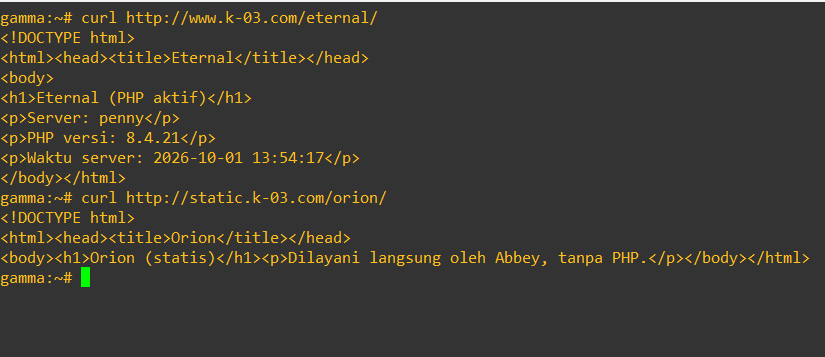

16. Ketahanan gerbang The Mesh harus diuji untuk menghadapi bombardir permintaan. Salah satu Klien (misal: Alpha) bertugas melakukan stress test benchmark menggunakan ApacheBench. Lakukan 250 requests dengan tingkat konkurensi (concurrencies) 10 untuk masing - masing titik akhir: www.xxx.com dan static.xxx.com. Tampilkan rangkuman hasilnya.

Untuk scriptnya sebagai berikut:

```sh
#!/bin/sh

DOMAIN="k-03.com"
N=250
C=10

[ "$(id -u)" = "0" ] || { echo "Jalankan sebagai root"; exit 1; }

echo "[1/3] Install ApacheBench..."
apk update
apk add apache2-utils || { echo "Gagal apk add (cek DNS/internet)"; exit 1; }

run_ab() {
    URL="$1"
    OUT="/tmp/ab-$(echo "$URL" | sed 's|http://||; s|[^A-Za-z0-9]|_|g').txt"
    echo
    echo "============================================================"
    echo " ab -n $N -c $C $URL"
    echo "============================================================"
    ab -n "$N" -c "$C" "$URL" > "$OUT" 2>&1
    grep -E "^Server Hostname|^Document Path|^Document Length|^Concurrency Level|^Time taken|^Complete requests|^Failed requests|^Non-2xx|^Requests per second|^Time per request|^Transfer rate" "$OUT"
    echo "(output lengkap: $OUT)"
}

echo "[2/3] Tes www.$DOMAIN (gerbang penny -> vault)"
run_ab "http://www.$DOMAIN/"

echo "[3/3] Tes static.$DOMAIN (gerbang abbey -> core)"
run_ab "http://static.$DOMAIN/"

echo
echo "Result: "
for f in /tmp/ab-http_www_*.txt /tmp/ab-http_static_*.txt; do
    [ -f "$f" ] || continue
    HOST=$(awk '/^Server Hostname/{print $3}' "$f")
    DONE=$(awk '/^Complete requests/{print $3}' "$f")
    FAIL=$(awk '/^Failed requests/{print $3}' "$f")
    N2=$(awk '/^Non-2xx/{print $3}' "$f"); N2=${N2:-0}
    RPS=$(awk '/^Requests per second/{print $4}' "$f")
    TPR=$(awk '/^Time per request/ && /mean\)$/ && !/across/{print $4}' "$f" | head -n1)
    echo "$HOST : complete=$DONE failed=$FAIL non2xx=$N2 rps=$RPS ms/req(mean)=$TPR"
done
echo
```

Hasilnya akan disimpan berupa txt. Berikut imagenya:

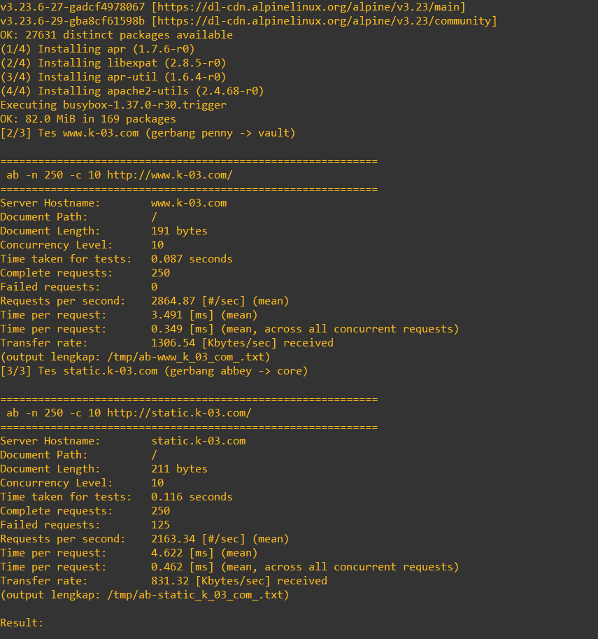 

dan hasilnya sebagai berikut:

```txt
gamma:~# cat /tmp/*.txt
This is ApacheBench, Version 2.3 <$Revision: 1934973 $>
Copyright 1996 Adam Twiss, Zeus Technology Ltd, http://www.zeustech.net/
Licensed to The Apache Software Foundation, http://www.apache.org/

Benchmarking static.k-03.com (be patient)
Completed 100 requests
Completed 200 requests
Finished 250 requests


Server Software:        nginx
Server Hostname:        static.k-03.com
Server Port:            80

Document Path:          /
Document Length:        211 bytes

Concurrency Level:      10
Time taken for tests:   0.116 seconds
Complete requests:      250
Failed requests:        125
   (Connect: 0, Receive: 0, Length: 125, Exceptions: 0)
Total transferred:      98375 bytes
HTML transferred:       52625 bytes
Requests per second:    2163.34 [#/sec] (mean)
Time per request:       4.622 [ms] (mean)
Time per request:       0.462 [ms] (mean, across all concurrent requests)
Transfer rate:          831.32 [Kbytes/sec] received

Connection Times (ms)
              min  mean[+/-sd] median   max
Connect:        0    1   0.3      1       2
Processing:     2    3   0.8      3       7
Waiting:        2    3   0.8      3       7
Total:          3    4   0.8      4       8

Percentage of the requests served within a certain time (ms)
  50%      4
  66%      5
  75%      5
  80%      5
  90%      5
  95%      6
  98%      8
  99%      8
 100%      8 (longest request)
This is ApacheBench, Version 2.3 <$Revision: 1934973 $>
Copyright 1996 Adam Twiss, Zeus Technology Ltd, http://www.zeustech.net/
Licensed to The Apache Software Foundation, http://www.apache.org/

Benchmarking www.k-03.com (be patient)
Completed 100 requests
Completed 200 requests
Finished 250 requests


Server Software:        Apache/2.4.68
Server Hostname:        www.k-03.com
Server Port:            80

Document Path:          /
Document Length:        191 bytes

Concurrency Level:      10
Time taken for tests:   0.087 seconds
Complete requests:      250
Failed requests:        0
Total transferred:      116750 bytes
HTML transferred:       47750 bytes
Requests per second:    2864.87 [#/sec] (mean)
Time per request:       3.491 [ms] (mean)
Time per request:       0.349 [ms] (mean, across all concurrent requests)
Transfer rate:          1306.54 [Kbytes/sec] received

Connection Times (ms)
              min  mean[+/-sd] median   max
Connect:        0    1   0.2      1       2
Processing:     1    3   1.3      2      11
Waiting:        1    3   1.3      2      11
Total:          2    3   1.4      3      13

Percentage of the requests served within a certain time (ms)
  50%      3
  66%      3
  75%      3
  80%      3
  90%      4
  95%      6
  98%     10
  99%     11
 100%     13 (longest request)
gamma:~#
```

Jadi hasil dari txtnya memang saya copas aja karena ada 2 file dan banyak. Jadinya sekalian saja. Lanjut

17. Tambahkan TXT record pada DNS untuk semua klien sayap kiri dan sayap kanan (Alpha, Beta, Gamma, Delta, Epsilon). Jika DNS di-query TXT terhadap nama domain mereka (contoh: alpha.<xxxx>.com), sistem harus mengembalikan teks berupa nama hostname mereka masing-masing (contoh: "alpha").

Scriptnya sebagai berikut:

```sh
#!/bin/sh
# SOAL 17 - TXT record untuk seluruh client
# Jalankan di: PRAB (DNS master)
# dig alpha.k-03.com TXT  ->  "alpha"   (dst. beta, gamma, delta, epsilon)

[ "$(id -u)" = "0" ] || { echo "Jalankan sebagai root"; exit 1; }

DOMAIN="k-03.com"
ZONE="/var/bind/db.$DOMAIN"
CLIENTS="alpha beta gamma delta epsilon"

[ -f "$ZONE" ] || { echo "Zone $ZONE tidak ditemukan (jalankan di PRAB)"; exit 1; }

echo "[1/4] Tambah TXT record..."
ADDED=0
for h in $CLIENTS; do
    if ! grep -qE "^$h[[:space:]]+IN[[:space:]]+TXT" "$ZONE"; then
        [ "$ADDED" = "0" ] && echo "" >> "$ZONE"
        printf '%s\tIN\tTXT\t"%s"\n' "$h" "$h" >> "$ZONE"
        ADDED=1
    fi
done

echo "[2/4] Naikkan serial SOA..."
if [ "$ADDED" = "1" ]; then
    CUR=$(awk '/SOA/{f=1;next} f&&/^[[:space:]]*[0-9]+/{print $1;exit}' "$ZONE")
    NEW=$((CUR + 1))
    awk -v n="$NEW" '/SOA/{f=1;print;next} f&&!d&&/^[[:space:]]*[0-9]+/{sub(/[0-9]+/,n);d=1} {print}' \
        "$ZONE" > "$ZONE.new" && mv "$ZONE.new" "$ZONE"
    echo "Serial: $CUR -> $NEW"
else
    echo "TXT sudah ada semua, serial tidak diubah"
fi

echo "[3/4] Validasi & reload BIND..."
named-checkzone "$DOMAIN" "$ZONE" || exit 1
killall named 2>/dev/null
sleep 1
named -c /etc/bind/named.conf
sleep 4   

echo "[4/4] Verifikasi"
echo "--- PRAB (10.65.2.3)"
for h in $CLIENTS; do
    printf '%s.%s -> ' "$h" "$DOMAIN"; dig @10.65.2.3 "$h.$DOMAIN" TXT +short
done
echo "--- TEDD (10.65.2.2)"
for h in $CLIENTS; do
    printf '%s.%s -> ' "$h" "$DOMAIN"; dig @10.65.2.2 "$h.$DOMAIN" TXT +short
done
echo "--- Serial"
echo "PRAB: $(dig @10.65.2.3 $DOMAIN SOA +short | awk '{print $3}')"
echo "TEDD: $(dig @10.65.2.2 $DOMAIN SOA +short | awk '{print $3}')"
echo
echo "Dari client:  dig alpha.$DOMAIN TXT +short   -> \"alpha\""
```

Nah selanjutnya jalankan scriptnya hasilnya sebagai berikut:

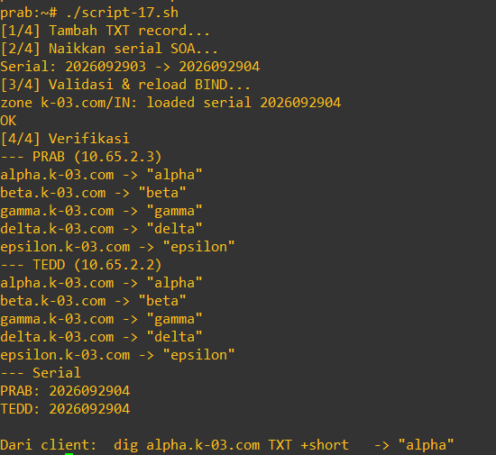

Kemudian di client (alpha contohnya) sebagai berikut:

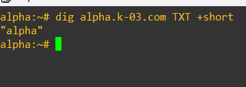

18. Ubah A record DNS milik abbey.xxx.com ke alamat IP yang fiktif (ubah secara random namun pastikan format IP valid). Naikkan nilai serial SOA di prab dan pastikan tedd ikut tersinkron. Tetapkan TTL sebesar 15 detik pada record yang relevan tersebut. Verifikasi momen yang terjadi pada tiga fase pencarian: sebelum perubahan terjadi (mengembalikan IP lama), saat perubahan baru saja terjadi dalam jeda 15 detik (masih IP lama karena cache), dan setelah batas waktu TTL habis (berubah ke IP fiktif yang baru). 

Scriptnya sebagai berikut

```sh
#!/bin/sh

[ "$(id -u)" = "0" ] || { echo "Jalankan sebagai root"; exit 1; }

DOMAIN="k-03.com"
ZONE="/var/bind/db.$DOMAIN"
HOST="abbey"
OLD_IP="10.65.4.2"
TTL=15
PRAB="10.65.2.3"
TEDD="10.65.2.2"
CDIR="/tmp/demo-cache"
CPORT=5353
NEW_IP=$(awk 'BEGIN{srand(); printf "203.0.113.%d", 1+int(rand()*253)}')   # IP fiktif valid

[ -f "$ZONE" ] || { echo "Zone $ZONE tidak ada (jalankan di PRAB)"; exit 1; }
grep -q "^$HOST[[:space:]]" "$ZONE" || { echo "Record $HOST tidak ada di zone"; exit 1; }

set_abbey() {
    sed -i -E "s/^$HOST[[:space:]].*/$HOST    $TTL    IN    A    $1/" "$ZONE"
}
bump_serial() {
    CUR=$(awk '/SOA/{f=1;next} f&&/^[[:space:]]*[0-9]+/{print $1;exit}' "$ZONE")
    NEW=$((CUR + 1))
    awk -v n="$NEW" '/SOA/{f=1;print;next} f&&!d&&/^[[:space:]]*[0-9]+/{sub(/[0-9]+/,n);d=1} {print}' \
        "$ZONE" > "$ZONE.new" && mv "$ZONE.new" "$ZONE"
    echo "   serial SOA: $CUR -> $NEW"
}
reload_main() {
    named-checkzone "$DOMAIN" "$ZONE" >/dev/null || { echo "Zone error!"; exit 1; }
    PID=$(ps -o pid,args | grep '[n]amed' | grep -v 'demo-cache' | awk '{print $1}' | head -n1)
    if [ -n "$PID" ]; then kill -HUP "$PID"; else named -c /etc/bind/named.conf; fi
    sleep 1
}
serial_of() { dig @"$1" +short +time=2 +tries=1 "$DOMAIN" SOA | awk '{print $3}'; }
wait_sync() {
    i=0
    while [ $i -lt 10 ]; do
        [ "$(serial_of $PRAB)" = "$(serial_of $TEDD)" ] && [ -n "$(serial_of $TEDD)" ] && return 0
        i=$((i+1)); sleep 1
    done
    return 1
}
cache_q() { dig @127.0.0.1 -p $CPORT +noall +answer +time=2 +tries=1 "$HOST.$DOMAIN" A; }
auth_q()  { printf '   %-14s' "$1"; dig @"$2" +short +time=2 +tries=1 "$HOST.$DOMAIN" A; }
stop_cache() { [ -f "$CDIR/named.pid" ] && kill "$(cat $CDIR/named.pid)" 2>/dev/null; sleep 1; }

echo "[0/5] Persiapan: abbey = $OLD_IP dengan TTL $TTL, sinkron ke tedd..."
set_abbey "$OLD_IP"; bump_serial; reload_main
wait_sync && echo "   tedd tersinkron (serial $(serial_of $TEDD))" || echo "   !! tedd belum sinkron"

echo "[1/5] Nyalakan resolver cache demo..."
stop_cache
mkdir -p "$CDIR"
cat > "$CDIR/named.conf" <<EOF
options {
    directory "$CDIR";
    pid-file "$CDIR/named.pid";
    session-keyfile "$CDIR/session.key";
    listen-on port $CPORT { 127.0.0.1; };
    listen-on-v6 { none; };
    allow-query { 127.0.0.1; };
    allow-recursion { 127.0.0.1; };
    recursion yes;
    forward only;
    forwarders { $PRAB; };
    dnssec-validation no;
};
controls { };
EOF
named -c "$CDIR/named.conf" || { echo "Gagal start resolver demo"; exit 1; }
i=0
until dig @127.0.0.1 -p $CPORT +short +time=2 +tries=1 prab.$DOMAIN A | grep -q .; do
    i=$((i+1)); [ $i -ge 8 ] && { echo "Resolver demo tidak merespons"; stop_cache; exit 1; }
    sleep 1
done

echo
echo "Sebelum perubahan"
cache_q
T0=$(date +%s)

echo
echo "[2/5] Mengubah $HOST.$DOMAIN -> $NEW_IP (secepat mungkin)..."
set_abbey "$NEW_IP"; bump_serial; reload_main

echo
echo "Perubahan baru terjadi"
cache_q
echo "   (selang sejak fase 1: $(( $(date +%s) - T0 )) detik)"
echo "   --- authoritative sudah memberi IP baru:"
auth_q "prab" "$PRAB"
i=0; while [ $i -lt 6 ] && [ "$(serial_of $PRAB)" != "$(serial_of $TEDD)" ]; do i=$((i+1)); sleep 1; done
auth_q "tedd" "$TEDD"
echo "   serial prab: $(serial_of $PRAB) | serial tedd: $(serial_of $TEDD)"

W=$((T0 + TTL + 2 - $(date +%s)))
echo
echo "[3/5] Menunggu TTL habis (${W}s)..."
[ "$W" -gt 0 ] && sleep "$W"

echo
echo "Perubahan setelah TTL habis"
cache_q
echo "   (selang sejak fase 1: $(( $(date +%s) - T0 )) detik)"

echo
echo "[4/5] Matikan resolver demo..."
stop_cache
echo "[5/5] Selesai. IP lama: $OLD_IP | IP fiktif sekarang: $NEW_IP"
```

Hasil scriptnya:


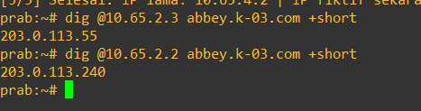

19. Last? But not least? Buat CNAME record yang melakukan binding dari domain internal outbound.xxx.com menuju domain eksternal http.badssl.com, Lakukan perintah curl ke http://outbound.xxx.com dan pastikan output yang dihasilkan sesuai dengan isi konten di halaman http.badssl.com.


Hasilnya seperti berikut

```txt
prab:~# ./script-19.sh
[1/4] Tambah CNAME (titik di akhir WAJIB: http.badssl.com.)...
[2/4] Naikkan serial & reload...
   serial: 2026100103 -> 2026100104
zone k-03.com/IN: loaded serial 2026100104
OK
[3/4] Verifikasi DNS (harus ada CNAME lalu A dari http.badssl.com)
--- @10.65.2.3
outbound.k-03.com.      86400   IN      CNAME   http.badssl.com.
http.badssl.com.        299     IN      A       104.154.89.105
--- @10.65.2.2
outbound.k-03.com.      86400   IN      CNAME   http.badssl.com.
http.badssl.com.        299     IN      A       104.154.89.105
[4/4] Verifikasi curl
curl outbound.k-03.com -> HTTP 200
curl http.badssl.com -> HTTP 200

HASIL: BEDA / kosong. Cek file:
  /tmp/out-outbound.html  vs  /tmp/out-original.html
Kemungkinan: (a) server badssl memilih halaman dari header Host, atau
             (b) prab/client tidak punya akses internet. Cek: dig +short http.badssl.com

--- Isi halaman outbound.k-03.com (potongan):
<!DOCTYPE html>
<html>
<head>
<title>Welcome to nginx!</title>
<style>
    body {
        width: 35em;
        margin: 0 auto;
        font-family: Tahoma, Verdana, Arial, sans-serif;
    }
</style>
</head>
<body>
<h1>Welcome to nginx!</h1>
<p>If you see this page, the nginx web server is successfully installed and
working. Further configuration is required.</p>

<p>For online documentation and support please refer to
<a href="http://nginx.org/">nginx.org</a>.<br/>
Commercial support is available at
<a href="http://nginx.com/">nginx.com</a>.</p>

<p><em>Thank you for using nginx.</em></p>
</bo

Dari client: curl http://outbound.k-03.com
prab:~#
```

Image result:

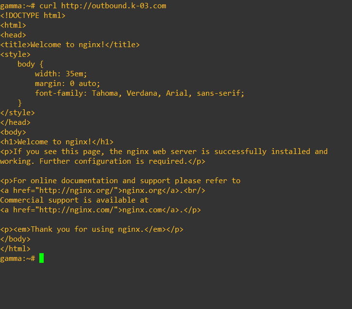

20. Setelah semua penyelesaian selesai, pastikan semua service dan konfigurasi yang telah dikerjakan dari awal tetap berjalan normal dan berstatus autostart saat node di-restart (khusus untuk kasus ini, abaikan konfigurasi nomor 18 dan biarkan koordinat kembali normal).

Scriptnya sebagai berikut:

```sh
#!/bin/sh

[ "$(id -u)" = "0" ] || { echo "Jalankan sebagai root"; exit 1; }

DOMAIN="k-03.com"
ZONE="/var/bind/db.$DOMAIN"
ABBEY_IP="10.65.4.2"
PRAB="10.65.2.3"
TEDD="10.65.2.2"
IFACES="${IFACES:-/etc/network/interfaces}"
ROLE="${1:-$(hostname)}"

if command -v rc-update >/dev/null 2>&1; then MODE="openrc"; else MODE="ifup"; fi
echo "SOAL 20 pada node: $ROLE | mode autostart: $MODE"

is_running() {   
    for d in /proc/[0-9]*; do
        [ "$(cat "$d/comm" 2>/dev/null)" = "$1" ] && return 0
    done
    return 1
}

svc_cmd() {      # perintah start manual tiap service
    case "$1" in
        named)     echo 'named -c /etc/bind/named.conf' ;;
        apache2)   echo 'mkdir -p /run/apache2; rm -f /run/apache2/httpd.pid; httpd' ;;
        nginx)     echo 'mkdir -p /run/nginx; nginx' ;;
        php-fpm84) echo 'php-fpm84' ;;
    esac
}

add_up() {       # $1=tag  $2=perintah ; sisipkan "up" di stanza interface (idempotent)
    tag="$1"; cmd="$2"
    [ -f "$IFACES" ] || { echo "!! $IFACES tidak ada"; return 1; }
    if grep -q "^[[:space:]]*# auto-$tag\$" "$IFACES"; then
        echo "   (baris up '$tag' sudah ada di $IFACES)"; return 0
    fi
    IFN=$(awk '$1=="iface" && $2!="lo"{print $2; exit}' "$IFACES")
    [ -n "$IFN" ] || { echo "!! stanza interface tidak ditemukan di $IFACES"; return 1; }
    awk -v ifn="$IFN" -v tag="$tag" -v cmd="$cmd" '
        { print }
        $1=="iface" && $2==ifn && !d { print "    # auto-" tag; print "    up " cmd; d=1 }
    ' "$IFACES" > "$IFACES.new" && mv "$IFACES.new" "$IFACES"
    echo "   + baris up '$tag' ditambahkan ke $IFACES ($IFN)"
}

enable_svc() {   
    svc="$1"; proc="$2"
    if [ "$MODE" = "openrc" ]; then
        if [ ! -x "/etc/init.d/$svc" ]; then
            echo "!! /etc/init.d/$svc tidak ada (paket belum ter-install?)"; return 1
        fi
        killall "$proc" 2>/dev/null
        sleep 1
        rm -f /run/apache2/httpd.pid /run/nginx/nginx.pid /run/named/named.pid /var/run/named/named.pid
        rc-update add "$svc" default >/dev/null 2>&1
        rc-service "$svc" restart >/dev/null 2>&1 || rc-service "$svc" start
        sleep 2
        if rc-service "$svc" status >/dev/null 2>&1 && rc-update show default | grep -qw "$svc"; then
            echo "OK   $svc : berjalan + autostart"
        else
            echo "GAGAL $svc : cek 'rc-service $svc status' dan log-nya"
        fi
    else
        cmd=$(svc_cmd "$svc")
        command -v "$proc" >/dev/null 2>&1 || { echo "!! $proc tidak ter-install"; return 1; }
        killall "$proc" 2>/dev/null
        sleep 1
        rm -f /run/apache2/httpd.pid /run/nginx/nginx.pid /run/named/named.pid /var/run/named/named.pid
        sh -c "$cmd" >/dev/null 2>&1
        sleep 2
        add_up "$svc" "$cmd >/dev/null 2>&1 || true"
        if is_running "$proc"; then
            echo "OK   $svc : berjalan + autostart (up-line)"
        else
            echo "GAGAL $svc : proses tidak jalan, coba manual: $cmd"
        fi
    fi
}

fix_bind_perms() {   
    [ "$MODE" = "openrc" ] || return 0
    id named >/dev/null 2>&1 || return 0
    [ -d /var/bind ] || return 0
    chgrp -R named /var/bind
    find /var/bind -type d -exec chmod 775 {} +
    find /var/bind -type f -exec chmod 664 {} +
}

http() { printf '   %-62s' "$*"; curl -s -o /dev/null -m 5 -w '%{http_code}\n' "$@"; }

case "$ROLE" in
prab)
    echo "[1/3] Batalkan soal 18: abbey -> $ABBEY_IP (TTL normal)"
    if [ -f "$ZONE" ]; then
        sed -i -E "/^abbey(\.$DOMAIN\.)?[[:space:]]+([0-9]+[[:space:]]+)?(IN[[:space:]]+)?A[[:space:]]/d" "$ZONE"
        [ -n "$(tail -c1 "$ZONE")" ] && echo >> "$ZONE"
        printf 'abbey    IN    A    %s\n' "$ABBEY_IP" >> "$ZONE"
        CUR=$(awk '/SOA/{f=1;next} f&&/^[[:space:]]*[0-9]+/{print $1;exit}' "$ZONE")
        NEW=$((CUR + 1))
        awk -v n="$NEW" '/SOA/{f=1;print;next} f&&!d&&/^[[:space:]]*[0-9]+/{sub(/[0-9]+/,n);d=1} {print}' \
            "$ZONE" > "$ZONE.new" && mv "$ZONE.new" "$ZONE"
        echo "   serial: $CUR -> $NEW"
        named-checkzone "$DOMAIN" "$ZONE" || exit 1
    fi
    echo "[2/3] named -> autostart"
    fix_bind_perms
    enable_svc named named
    sleep 3
    echo "[3/3] Verifikasi"
    echo "   abbey.$DOMAIN -> $(dig @127.0.0.1 +short abbey.$DOMAIN A) (harus $ABBEY_IP)"
    echo "   serial prab: $(dig @$PRAB +short $DOMAIN SOA | awk '{print $3}')"
    echo "   serial tedd: $(dig @$TEDD +short $DOMAIN SOA | awk '{print $3}')  (harus sama)"
    ;;
tedd)
    fix_bind_perms
    enable_svc named named
    sleep 3
    echo "   serial prab: $(dig @$PRAB +short $DOMAIN SOA | awk '{print $3}')"
    echo "   serial tedd: $(dig @$TEDD +short $DOMAIN SOA | awk '{print $3}')  (harus sama)"
    echo "   abbey.$DOMAIN @tedd -> $(dig @$TEDD +short abbey.$DOMAIN A) (harus $ABBEY_IP)"
    ;;
penny)
    enable_svc apache2 httpd
    enable_svc php-fpm84 php-fpm84
    http -H "Host: www.$DOMAIN" http://127.0.0.1/
    http -H "Host: www.$DOMAIN" http://127.0.0.1/admin/
    http -H "Host: www.$DOMAIN" http://127.0.0.1/eternal/
    ;;
abbey)
    enable_svc nginx nginx
    http -H "Host: static.$DOMAIN" http://127.0.0.1/
    http -H "Host: static.$DOMAIN" http://127.0.0.1/orion/
    ;;
obladi|desmond)
    enable_svc apache2 httpd
    http http://127.0.0.1/arsip/
    ;;
oblada|molly)
    enable_svc nginx nginx
    enable_svc php-fpm84 php-fpm84
    http -H "Host: core.$DOMAIN" http://127.0.0.1/
    http -H "Host: core.$DOMAIN" http://127.0.0.1/profil
    ;;
*)
    echo "Node '$ROLE' tidak menjalankan service yang perlu di-autostart."
    echo "Atau jalankan dengan argumen: sh auto.sh prab|tedd|penny|abbey|obladi|desmond|oblada|molly"
    ;;
esac

echo
if [ "$MODE" = "openrc" ]; then
    echo "Service autostart di node ini:"
    rc-update show default
else
    echo "Baris autostart di $IFACES:"
    grep -A1 '# auto-' "$IFACES"
fi
echo
echo "Hostname: $(hostname) | resolv.conf:"
cat /etc/resolv.conf
echo
```

Nah dalam script ini saya kasih automatic tiap nodenya. Terpasang pada: prab, tedd, penny, molly, abbey, obladi, oblada, desmond. Hasil scriptnya

[sebelum](./assets/jawaban/soal-20/sebelum/)

[sesudah](./assets/jawaban/soal-20/sesudah/)

Script tambahan:

- [script.sh](./src/jaga-jaga/script.sh) fungsinya ketika no 18 gk stabil
- [check-system.sh](./src/jaga-jaga/check-system.sh) fungsinya buat check apakah servernya masih up or belum